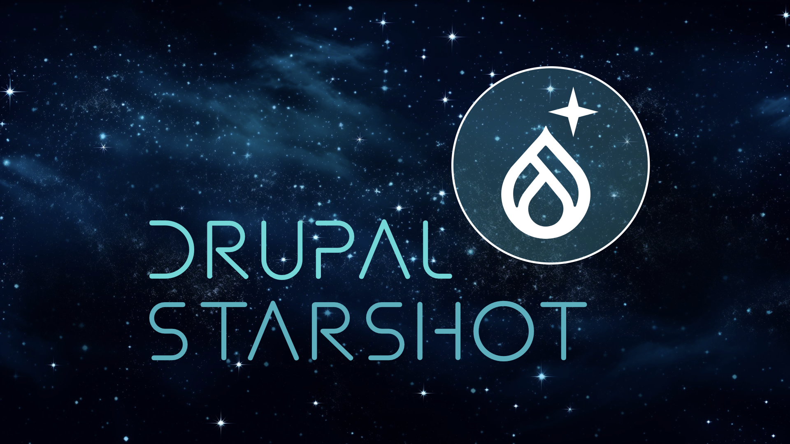
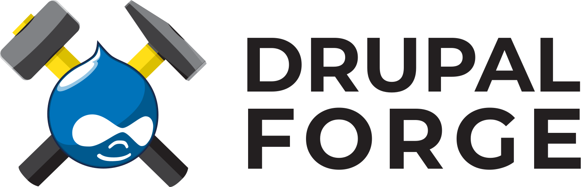

[](https://www.drupal.org/about/starshot)

# Starshot
Starshot is an initiative to create a Drupal CMS for non-technical users by the end of 2024. Launch Starshot on Drupal Forge. If you launch with a cloud development environment, you can use it to contribute to Drupal CMS.

<div align="center">
   <a href="https://www.drupalforge.org/form/subscription?template=14">
      <figure>
         
         <br />
         <figcaption>Launch Starshot</figcaption>
      </figure>
   </a>
</div>


## Contributing to Drupal CMS
1. Review the Drupal CMS [issue queue](https://www.drupal.org/project/issues/drupal_cms). Find or create an issue for your contribution.

2. Create or get push access to the [issue fork](https://www.drupal.org/docs/develop/git/using-gitlab-to-contribute-to-drupal/creating-issue-forks).

3. Open DevPanel VS Code and run the following commands:
   ```bash
   cd /var/www/html/drupal_cms
   git remote add <issue_number> https://<drupal.org_username>:<personal_access_token>@git.drupalcode.org/issue/drupal_cms-<issue_number>.git
   ```
   It is best practice to generate a [personal access token](https://git.drupalcode.org/-/user_settings/personal_access_tokens) rather than use your drupal.org password for `<personal_access_token>`.
4. Check out the branch for your issue:
   ```bash
   git checkout -b <issue_branch>
   ```
5. When you have committed your work, update the branch and push your changes:
   ```bash
   git pull --rebase
   git push
   ```
